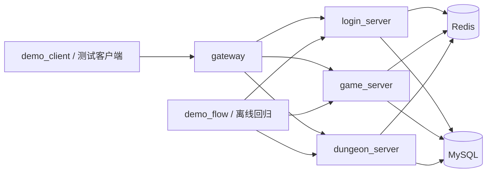

# Mobile Game Backend Demo

一个面向**游戏业务服社招**的 `C++17` 求职 demo。  
项目现在同时保留两套展示入口：

- `demo_flow`：离线直连业务对象，适合讲业务规则和一致性
- `demo_client -> gateway -> login/game/dungeon`：真实四进程网络闭环，适合讲系统形态和联调能力

## 项目卖点

- **纯 C++ 主链路**：登录、角色加载、副本进入、结算都在同一套工程里。
- **双入口演示**：既能用 `demo_flow` 快速回归，也能用 `demo_client` 走真实网络链路。
- **真实依赖闭环**：MySQL 负责最终真相，Redis 负责 session、玩家快照、玩家锁、战斗上下文。
- **面试友好**：业务边界、仓储分层、缓存策略、幂等与事务都能直接展开。

## 系统结构



## 核心链路

`Login(account_name, password) -> session_id, player_id`

`LoadPlayer(session_id, player_id) -> player_state`

`EnterDungeon(session_id, player_id, dungeon_id) -> battle_id, remain_stamina`

`SettleDungeon(session_id, player_id, battle_id, dungeon_id, star, result) -> rewards`

关键规则：

- 登录成功后写入 Redis `session:{session_id}`，同账号旧会话失效。
- 角色加载优先读 Redis `player:snapshot:{player_id}`，未命中再回源 MySQL。
- 进入副本先校验再扣体力，再写 `dungeon_battle` 挑战记录。
- 结算时校验 `battle_id / player_id / dungeon_id` 一致性。
- 奖励发放、副本进度、奖励流水在同一个 MySQL 事务中提交。
- `gateway` 只负责连接、路由和会话绑定，不承载业务规则。

## 目录

```text
.
|-- common/          # 配置、日志、MySQL/Redis 封装、网络层、公共模型
|-- proto/           # protobuf 协议
|-- login_server/    # 账号鉴权、Redis session、TCP 服务入口
|-- game_server/     # 角色加载、Redis 快照、TCP 服务入口
|-- dungeon_server/  # 进入副本、结算、奖励发放、TCP 服务入口
|-- gateway/         # 客户端接入、路由、连接绑定
|-- tools/           # demo_flow / demo_client
|-- deploy/          # Docker Compose 与初始化 SQL
|-- configs/         # 服务配置
|-- scripts/         # 本地运行脚本
`-- docs/            # 架构说明、代码导读、面试讲述文档
```

## 快速开始

本地依赖：

- MySQL：`3307`
- Redis：`6379`

启动依赖：

```bash
docker compose -f deploy/docker-compose.yml up -d
```

构建：

```bash
cmake -S . -B build
cmake --build build -j
```

## 两种演示方式

### 1. 离线业务回归

```bash
./build/demo_flow \
  --login-config configs/login_server.conf \
  --game-config configs/game_server.conf \
  --dungeon-config configs/dungeon_server.conf
```

### 2. 真实网络闭环

先分别启动：

```bash
./build/login_server --config configs/login_server.conf
./build/game_server --config configs/game_server.conf
./build/dungeon_server --config configs/dungeon_server.conf
./build/gateway --config configs/gateway.conf
```

再执行：

```bash
./build/demo_client \
  --gateway-config configs/gateway.conf \
  --login-config configs/login_server.conf \
  --game-config configs/game_server.conf \
  --dungeon-config configs/dungeon_server.conf
```

一键脚本：

```bash
./scripts/run_network_demo.sh
```

## 推荐演示流程

1. 先跑 `demo_flow`，讲业务闭环和事务、一致性。
2. 再跑 `demo_client`，讲真实 `gateway + 三服` 网络链路。
3. 展示负例：
   - 错误密码
   - 无效 session
   - 重复结算
   - 非法星级
   - 后端服务不可用

## 面试可讲点

- 为什么 session 放 Redis，而不是只放进程内存
- 为什么角色加载走“Redis 快照优先，MySQL 最终真相”
- 为什么体力在进入副本时扣，而不是结算时扣
- 为什么要用 Redis 玩家锁 + MySQL 状态双重拦截重复结算
- 为什么保留 `demo_flow` 作为无网络干扰的离线回归入口
- 为什么 V1 先做 TCP/protobuf 和四进程闭环，而不引入 RPC 框架

建议搭配阅读：

- [架构说明](/home/wang/main/project/server/docs/mobile-game-backend-replica/architecture.md)
- [技术选型](/home/wang/main/project/server/docs/mobile-game-backend-replica/tech-stack.md)
- [面试讲述稿](/home/wang/main/project/server/docs/interview-walkthrough.md)
