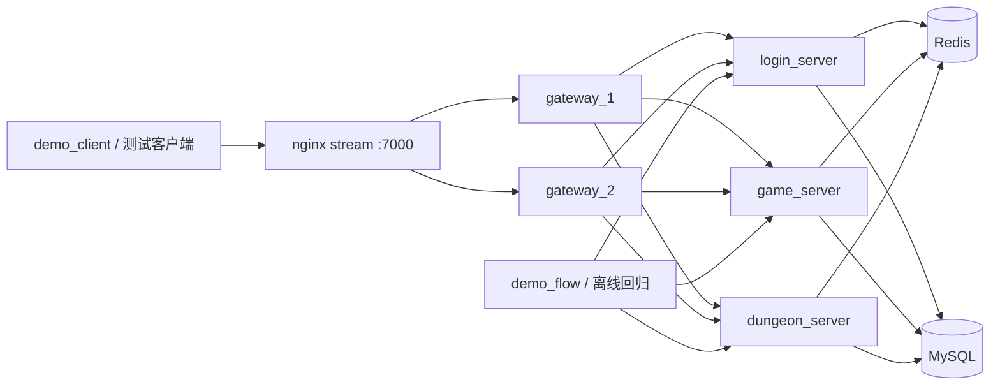

# Mobile Game Backend Demo

一个面向**游戏业务服社招**的 `C++17` 求职 demo。  
项目现在同时保留两套展示入口：

- `demo_flow`：离线直连业务对象，作为业务回归基线
- `demo_client -> nginx(stream) -> gateway_1/gateway_2 -> login/game/dungeon`：容器化接入层闭环，适合讲多实例接入与联调能力

## 项目卖点

- **纯 C++ 主链路**：登录、角色加载、副本进入、结算都在同一套工程里。
- **双入口演示**：既能用 `demo_flow` 快速回归，也能用 `demo_client` 走 `Nginx + 多 Gateway` 真实网络链路。
- **真实依赖闭环**：MySQL 负责最终真相，Redis 负责 session、玩家快照、玩家锁、战斗上下文。
- **面试友好**：业务边界、仓储分层、缓存策略、幂等与事务都能直接展开。

## 系统结构



## 核心链路

`Login(account_name, password) -> session_id, player_id`

`LoadPlayer(session_id, player_id) -> player_state`

`EnterDungeon(session_id, player_id, dungeon_id) -> battle_id, remain_stamina`

`SettleDungeon(session_id, player_id, battle_id, dungeon_id, star, result) -> rewards`

关键规则：

- 登录成功后写入 Redis `session:{session_id}`，同账号旧会话失效。
- 角色加载优先读 Redis `player:snapshot:{player_id}`，未命中再回源 MySQL。
- 进入副本先校验再扣体力，再写 `dungeon_battle` 挑战记录。
- 结算时校验 `battle_id / player_id / dungeon_id` 一致性。
- 奖励发放、副本进度、奖励流水在同一个 MySQL 事务中提交。
- `gateway` 只负责连接、路由和会话绑定，不承载业务规则。
- 客户端换连到新的 `gateway` 时，可基于 Redis `session:{session_id}` 自动恢复当前连接绑定。

## 目录

```text
.
|-- common/          # 配置、日志、MySQL/Redis 封装、网络层、公共模型
|-- proto/           # protobuf 协议
|-- login_server/    # 账号鉴权、Redis session、TCP 服务入口
|-- game_server/     # 角色加载、Redis 快照、TCP 服务入口
|-- dungeon_server/  # 进入副本、结算、奖励发放、TCP 服务入口
|-- gateway/         # 客户端接入、路由、连接绑定、Redis 会话恢复
|-- tools/           # demo_flow / demo_client
|-- deploy/          # Docker Compose、Nginx 与初始化 SQL
|-- configs/         # 服务配置
|-- scripts/         # 本地运行脚本
`-- docs/            # 架构说明、代码导读、面试讲述文档
```

## 快速开始

本地会用到这些宿主端口：

- MySQL：`3307`
- Redis：`6379`
- Nginx 接入层：`7000`

本地构建：

```bash
cmake -S . -B build
cmake --build build -j
```

本地单测：

```bash
./scripts/test.sh
```

## 两种演示方式

### 1. 离线业务回归

```bash
./build/demo_flow \
  --login-config configs/login_server.conf \
  --game-config configs/game_server.conf \
  --dungeon-config configs/dungeon_server.conf
```

### 2. 多 Gateway 网络闭环

推荐直接跑主脚本：

```bash
./scripts/run_multi_gateway_demo.sh
```

这个脚本会：

- `docker compose up -d --build --wait` 拉起 `mysql/redis/login/game/dungeon/gateway_1/gateway_2/nginx`
- 用本地 `demo_client` 连接宿主机 `127.0.0.1:7000`
- 登录后通过第二条连接直接发非登录请求，验证 Redis 会话恢复
- 回看 `gateway_1`、`gateway_2` 日志，确认两个网关都收到了请求，且至少出现一次 `bind restored from redis`

兼容入口仍保留：

```bash
./scripts/run_network_demo.sh
```

## 推荐演示流程

1. 先跑 `demo_flow`，讲业务闭环和事务、一致性。
2. 再跑 `demo_client`，讲真实 `nginx + 多 gateway + 三服` 网络链路。
3. 展示负例：
   - 错误密码
   - 无效 session
   - 重复结算
   - 非法星级
   - 后端服务不可用
4. 补一段接入层说明：
   - `Nginx` 只做 TCP `stream` 转发
   - `gateway` 保留连接级本地绑定，跨网关恢复依赖 Redis session

## 面试可讲点

- 为什么 session 放 Redis，而不是只放进程内存
- 为什么 `Nginx` 只做 `stream` 负载均衡，而不承载业务会话逻辑
- 为什么多 Gateway 下还要保留连接级本地绑定缓存
- 为什么角色加载走“Redis 快照优先，MySQL 最终真相”
- 为什么体力在进入副本时扣，而不是结算时扣
- 为什么要用 Redis 玩家锁 + MySQL 状态双重拦截重复结算
- 为什么保留 `demo_flow` 作为无网络干扰的离线回归入口
- 为什么 V1 先做 TCP/protobuf 和多 Gateway 接入层，而不引入 RPC 框架

建议搭配阅读：

- [架构说明](/home/wang/main/project/server/docs/mobile-game-backend-replica/architecture.md)
- [技术选型](/home/wang/main/project/server/docs/mobile-game-backend-replica/tech-stack.md)
- [面试讲述稿](/home/wang/main/project/server/docs/interview-walkthrough.md)
