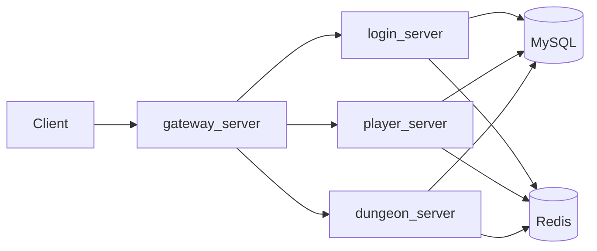
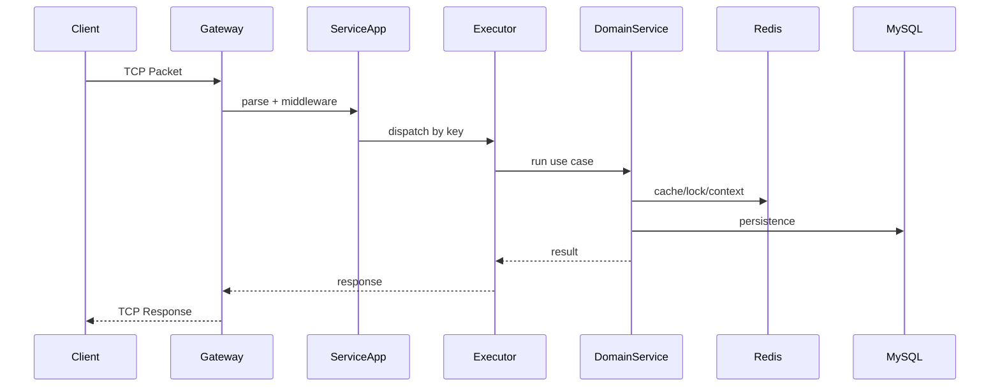

# 02 系统架构

## 1. 总体架构

当前系统采用多服务进程结构，核心组件包括 `gateway_server`、`login_server`、`player_server`、`dungeon_server`，以及 MySQL 和 Redis。

## 2. 服务职责

- `gateway_server`：接入、会话恢复、消息转发、响应校验
- `login_server`：账号鉴权、session 创建与失效控制
- `player_server`：玩家状态加载、缓存读取与回源
- `dungeon_server`：进入副本、战斗上下文、结算和奖励发放

## 3. 当前是否需要分布式架构

结论：

- 当前已经具备分布式特征，但还不需要复杂分布式治理体系。

当前具备的特征：

- 多进程服务拆分
- Gateway 可横向扩展
- 服务通过网络转发协作
- Redis 承担共享 session 和部分跨实例状态

当前不建议优先引入：

- 注册中心
- RPC 治理框架
- MQ
- 分布式事务框架
- 服务网格

当前更重要的是先把代码边界、模型边界、线程模型和观测能力写清楚。

## 4. 公共框架

`framework/` 负责：

- transport
- protocol
- execution
- service lifecycle

它是服务公共底座，不承担具体业务语义。

## 5. 数据依赖

- MySQL：最终真相、事务一致性、业务持久化
- Redis：session、snapshot、lock、battle context

## 6. 线程与运行时模型

### 6.1 运行时主链路

### 6.2 线程模型

- `transport.io_threads`
  负责网络连接、收包、发包和回调分发。

- `request executor`
  负责业务请求执行，按 `connection/session/player` 生成 key 并落到固定 shard。

- `gateway forward executor`
  负责网关到上游服务的转发任务，与 transport 线程分离。

### 6.3 当前执行语义

- 同一 execution key 上的请求串行执行。
- 不同 key 可以并行执行。
- transport 线程只负责收发和回调派发，不直接承载业务编排。
- executor 使用队列上限做背压，队列满会直接拒绝新请求。
- shutdown 时先停止接收，再等待 drain，超过 grace timeout 后继续关闭线程。

### 6.4 当前最重要的运行时约束

- 线程安全不能依赖“碰巧没并发”。
- 任何异常路径都不能静默丢请求。
- 超时、队列满和 drain 超时必须可观测。

## 7. 当前推荐演进方向

架构上建议继续保留当前服务划分，但代码内部收敛为统一分层：

- 接入层
- 应用层
- 领域层
- 基础设施层

先收代码边界，再决定是否继续拆分运行时架构。
