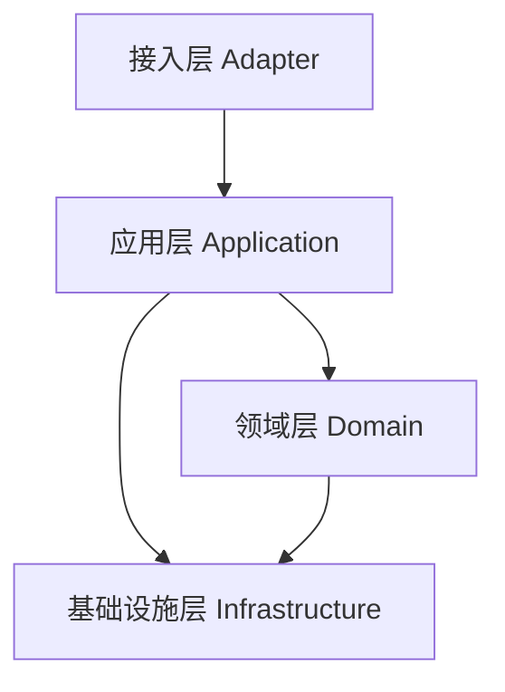
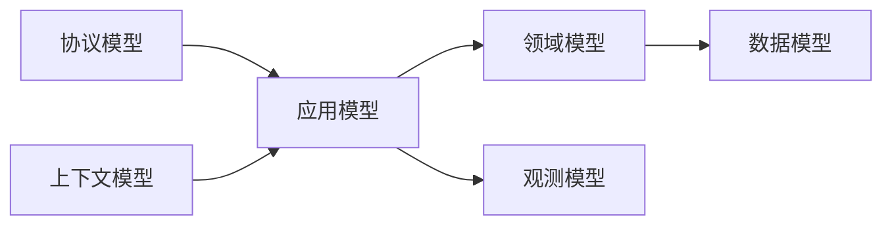

# 03 系统设计

## 1. 设计目标

这份文档统一说明系统的分层、模型和技术路线，避免这些内容散落在多份文档里。

当前设计目标：

- 边界清晰
- 模型清晰
- 技术简单
- 易于重构
- 能支撑后续商业化演进

## 2. 推荐分层

### 2.1 各层职责

- 接入层
  负责协议解析、上下文补全、错误映射、响应回包、网关转发。

- 应用层
  负责用例编排、调用顺序、事务边界、跨组件协调。
  内部优先按“前置校验 -> 仓储读取 -> 规则判断 -> 状态写回 -> 结果组装”拆步。

- 领域层
  负责业务规则、约束、不变量和状态演进。

- 基础设施层
  负责 MySQL、Redis、TCP、protobuf、配置、日志和监控实现。

### 2.2 当前仓库落位建议

- `services/`
  收敛为接入层适配器，`*_server_app` 只负责解析、调用和回包，固定采用共享 helper 驱动的 `Handle...Request -> Build...ResponsePacket` 模式。

- `login_server/` `game_server/` `dungeon_server/`
  分别承载登录域、玩家域、副本域代码；其中 `LoginService`、`PlayerService`、`DungeonService` 当前作为应用服务承载用例编排。

- `framework/`
  作为运行时与基础设施底座。

- `*_repository` 接口
  作为应用服务依赖的存储边界；`mysql_*`、`redis_*` 为边界实现，不让接入层直接穿透。

## 3. 模型体系

### 3.1 模型分类

- 协议模型
  `protobuf` request/response、message id、packet。

- 上下文模型
  `trace_id`、`request_id`、`session_id`、`player_id`、`connection_id`、`executor_shard`。

- 应用模型
  command、query、result，以及用例输入输出。

- 领域模型
  玩家、会话、副本、奖励、战斗上下文等核心业务对象。

- 数据模型
  MySQL row、Redis snapshot、battle context record。

- 观测模型
  请求日志、错误事件、指标维度、审计事件。

### 3.2 模型原则

- 协议模型不直接等于领域模型。
- 数据模型不直接暴露到接入层。
- 上下文模型不承载复杂业务规则。
- 领域模型不直接依赖 protobuf、Redis、MySQL 客户端。
- repository 作为存储边界暴露给应用服务，接入层不直接依赖具体存储实现。
- 跨层转换显式编写，不做隐式混用。

## 4. 技术选型

### 4.1 当前推荐栈

- 语言：`C++17`
- 构建：`CMake`
- 平台：`Linux`
- 通信：自定义 `TCP`
- 协议：`protobuf`
- 数据库：`MySQL 8`
- 缓存与锁：`Redis 7`
- 基础依赖：`Boost::system`、`OpenSSL`

### 4.2 选型原则

- 成熟优先
- 简单优先
- 收益明确才引入复杂组件
- 先补工程能力，再补大型中间件

### 4.3 当前不优先引入

- RPC 框架
- 消息队列
- ORM
- 服务网格
- 复杂服务发现
- 过度微服务拆分

## 5. 设计原则

- 边界优先于技巧
- 用例优先于组件堆叠
- 稳定优先于炫技
- 可观测优先于隐式假设
- 小步重构优先于一次性重写
