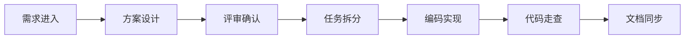

# 04 开发流程

## 1. 标准流程

## 2. 各阶段要求

### 2.1 需求

- 明确目标、范围、验收标准和风险。
- 判断是功能需求、缺陷修复还是架构演进。

### 2.2 设计

- 明确改动落在哪一层。
- 明确模型变化、接口变化、配置变化。
- 涉及并发、超时、shutdown 时必须写清运行时影响。

### 2.3 开发

- 先收边界，再写细节。
- 先统一契约，再补实现。
- 不把临时逻辑堆到 `*_server_app` 和 `gateway_server_app`。
- 接入层优先复用共享 helper，保持固定模板：`Handle...Request -> Build...ResponsePacket`。

### 2.4 代码走查

- 重点看分层是否正确。
- 重点看模型是否混乱。
- 重点看异常路径和并发语义是否完整。

### 2.5 文档同步

- 涉及架构、模型、线程模型变化时同步更新文档。
- 不再额外堆零散说明，统一更新正式文档。

## 3. 输出物

每次中大型改动至少应有：

- 问题定义
- 方案说明
- 改动范围
- 关键取舍
- 文档更新点

## 4. 文档更新规则

发生以下情况时必须同步更新文档：

- 新增服务
- 新增核心模型
- 修改线程模型
- 修改消息协议
- 修改技术选型
