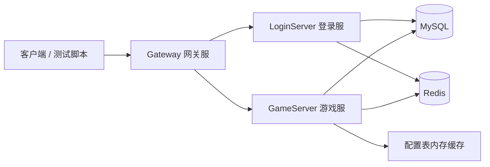
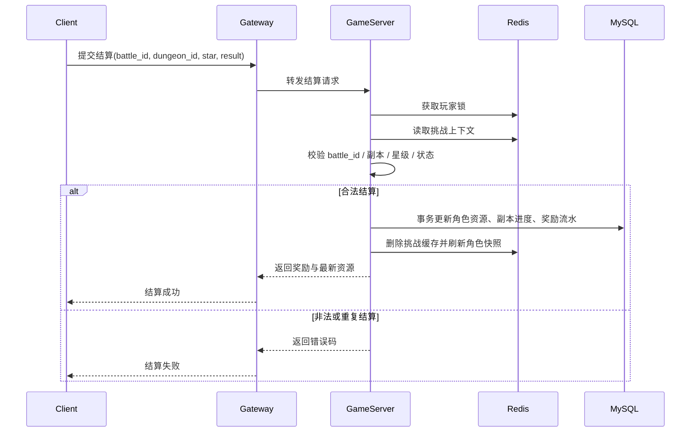

# 手游后端复现架构说明

## 1. 复现目标

这套复现方案只保留最能体现手游服务端工程能力的主链路：

- 账号鉴权
- 角色数据加载与保存
- 单人副本进入与结算

首版目标不是把所有玩法做全，而是做出一个结构清晰、流程完整、便于演示和扩展的后端系统。

## 2. 系统总览



建议先采用单区单服模型：

- `Gateway`：负责连接接入、协议路由、基础限流、会话绑定。
- `LoginServer`：负责账号校验、登录态生成、重复登录处理。
- `GameServer`：负责角色、背包、资源、副本、奖励等核心业务。
- `MySQL`：负责最终数据持久化。
- `Redis`：负责会话缓存、玩家锁、角色快照、挑战上下文缓存。

## 3. 服务职责划分

### Gateway

- 维护客户端连接与心跳。
- 校验协议头与基础参数。
- 将登录相关请求路由到 `LoginServer`，将业务请求路由到 `GameServer`。
- 维护 `conn_id -> session_id -> player_id` 的映射关系。

### LoginServer

- 校验账号密码或测试令牌。
- 生成登录态 `token/session_id`。
- 处理重复登录，将旧会话标记失效。
- 返回角色列表或默认角色信息。

### GameServer

- 加载玩家基础数据、资源数据、背包数据和副本进度。
- 处理在线玩家内存对象与保存时机。
- 实现副本进入条件判断、体力扣减、挑战记录创建。
- 实现副本结算校验、首通奖励、普通掉落、重复领奖拦截。

## 4. 核心业务流程

### 4.1 登录与角色加载

1. 客户端连接网关并发起登录请求。
2. 网关将请求转发给 `LoginServer`。
3. `LoginServer` 校验账号后写入 Redis 会话，并返回 `token/session_id`。
4. 客户端携带登录态请求进入游戏。
5. `GameServer` 从 Redis 检查会话合法性，加载角色数据：
   - 优先读取 Redis 快照。
   - 缓存未命中时从 MySQL 拉取并回填缓存。
6. `GameServer` 建立在线玩家对象，返回角色资源与副本信息。

### 4.2 副本进入

进入副本前建议完成以下校验：

- 玩家是否在线，登录态是否有效。
- 副本配置是否存在且已开放。
- 玩家等级、章节、前置副本条件是否满足。
- 体力是否充足。
- 是否存在未完成或未结算的挑战记录。

校验通过后：

1. 加玩家锁。
2. 扣减体力。
3. 生成唯一 `battle_id`。
4. 创建挑战记录并写入 Redis/MySQL。
5. 返回副本实例信息给客户端。

### 4.3 副本结算



结算阶段必须重点保证三件事：

- 幂等：同一个 `battle_id` 只能成功结算一次。
- 一致性：奖励、体力、副本进度、流水必须在同一事务中提交。
- 可追踪：日志里必须带上 `player_id`、`dungeon_id`、`battle_id`、错误码。

## 5. 数据设计建议

### 5.1 MySQL 表建议

- `account`
  - `account_id`
  - `account_name`
  - `password_hash`
  - `status`
  - `created_at`
- `player`
  - `player_id`
  - `account_id`
  - `name`
  - `level`
  - `exp`
  - `last_login_at`
- `player_asset`
  - `player_id`
  - `stamina`
  - `gold`
  - `diamond`
- `player_item`
  - `player_id`
  - `item_id`
  - `count`
- `player_dungeon`
  - `player_id`
  - `dungeon_id`
  - `best_star`
  - `is_first_clear`
  - `last_clear_at`
- `dungeon_battle`
  - `battle_id`
  - `player_id`
  - `dungeon_id`
  - `status`
  - `cost_stamina`
  - `start_at`
  - `finish_at`
- `reward_log`
  - `id`
  - `player_id`
  - `battle_id`
  - `reward_type`
  - `reward_json`
  - `created_at`

建议唯一约束：

- `dungeon_battle.battle_id`
- `reward_log(player_id, battle_id, reward_type)`
- `player_dungeon(player_id, dungeon_id)`

### 5.2 Redis Key 建议

- `session:{session_id}`：登录态与账号、角色映射。
- `player:lock:{player_id}`：玩家写操作串行化锁。
- `player:snapshot:{player_id}`：角色缓存快照。
- `battle:ctx:{battle_id}`：挑战上下文与进入副本时的快照数据。
- `player:online:{player_id}`：在线状态与网关连接信息。

## 6. 一致性与防作弊策略

### 6.1 为什么体力在进入时扣

如果体力在结算时再扣，客户端可以反复尝试副本却不承担成本。进入副本时先扣体力更符合手游常见做法，也更容易与挑战记录绑定。

### 6.2 为什么要有挑战记录

挑战记录是结算合法性的依据。没有它，服务端无法证明这次结算请求确实来自一次有效挑战。

挑战记录至少要保存：

- `battle_id`
- `player_id`
- `dungeon_id`
- `start_at`
- `status`
- `cost_stamina`
- 进入时的关键快照，如难度、预期掉落池版本

### 6.3 如何防重复领奖

采用“双保险”：

- Redis 玩家锁，保证同一角色结算请求串行。
- MySQL 唯一约束，保证即使并发穿透也不会重复插入奖励流水。

### 6.4 如何识别非法结算

至少做以下校验：

- `battle_id` 是否存在。
- `battle_id` 是否属于当前 `player_id`。
- `dungeon_id` 是否与挑战记录一致。
- 结算状态是否已完成。
- 星级、耗时、胜负结果是否在可接受范围内。
- 是否超过最大结算时限。

## 7. 推荐工程目录

```text
server/
  CMakeLists.txt
  common/
    net/
    proto/
    config/
    log/
    mysql/
    redis/
    util/
  gateway/
    main.cpp
    session/
    router/
  login_server/
    main.cpp
    auth/
    session/
  game_server/
    main.cpp
    player/
    dungeon/
    reward/
    gm/
  configs/
  scripts/
  deploy/
    docker-compose.yml
  docs/
    mobile-game-backend-replica/
```

## 8. 推荐复现顺序

最稳妥的顺序是：

1. 跑通环境和空服务。
2. 跑通登录与角色加载。
3. 做玩家保存与缓存回填。
4. 做副本进入和挑战记录。
5. 做副本结算与奖励事务。
6. 最后补日志、GM、测试脚本和部署说明。

这样做的好处是每一步都有可验证结果，不会一开始就陷入“大而全但跑不起来”的状态。
