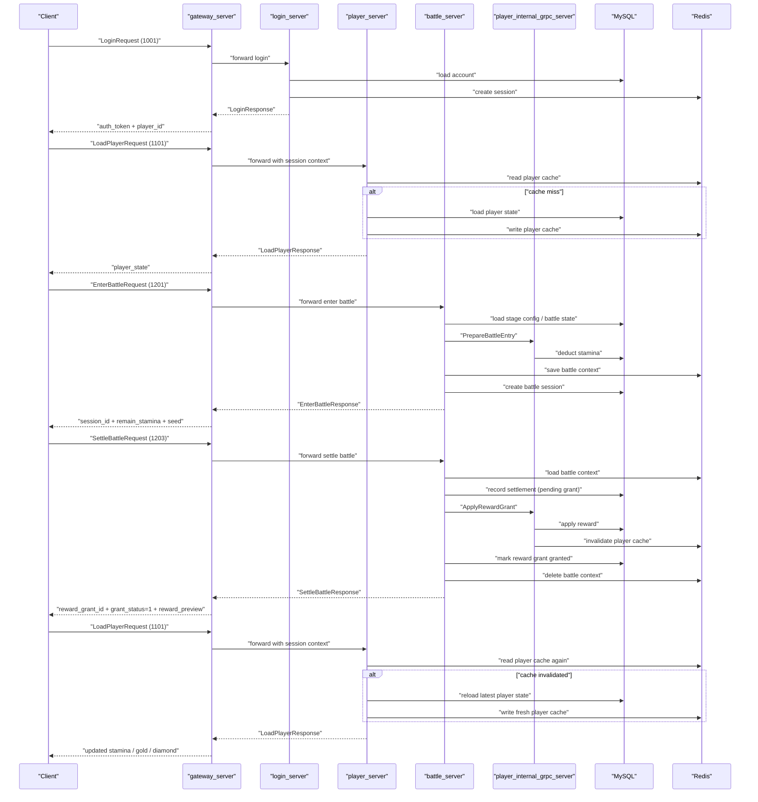

# MVP Main Flow

这份文档只描述当前代码已经实现并跑通的主业务闭环，不展开 `delivery/prod`、发行版部署和后续扩展系统。

## 目标边界

当前 MVP 只覆盖这条主链：

1. `Login`
2. `LoadPlayer`
3. `EnterBattle`
4. `SettleBattle`
5. `LoadPlayer` 再次确认资产变化

辅助接口：

- `GetRewardGrantStatus`

当前语义下，`GetRewardGrantStatus` 仍然保留，但它已经不是主流程依赖。`SettleBattle` 成功后奖励会同步到账，`grant_status` 直接完成。

## 服务分工

- `gateway_server`：客户端接入、限流、会话恢复、上游转发
- `login_server`：账号校验、session 签发
- `player_server`：玩家状态读取、缓存回源
- `battle_server`：进入战斗、结算、奖励计算
- `player_internal_grpc_server`：玩家域内部写操作，包括扣体力和发奖励

## 主流程

### 1. Login

客户端发送 `LoginRequest`，使用消息号 `1001`。

关键输入：

- `account_name`
- `password`

关键输出：

- `auth_token`
- `account_id`
- `player_id`
- `expires_at_epoch_seconds`

服务行为：

- `gateway_server` 接收并转发
- `login_server` 查询账号
- 校验账号可登录状态
- 校验密码哈希
- 创建 session
- 返回默认玩家 `player_id`

代码参考：

- [proto/game_backend.proto](/home/love/code/server/proto/game_backend.proto)
- [runtime/protocol/message_id.h](/home/love/code/server/runtime/protocol/message_id.h)
- [modules/login/application/login_service.cpp](/home/love/code/server/modules/login/application/login_service.cpp)

### 2. LoadPlayer

客户端发送 `LoadPlayerRequest`，使用消息号 `1101`。

关键输入：

- `player_id`
- `auth_token`

关键输出：

- `player_state`
- `loaded_from_cache`

服务行为：

- `gateway_server` 从 session 恢复 `account_id/player_id`
- `player_server` 先读 Redis 缓存
- miss 时回源 MySQL
- 回填缓存并返回玩家状态

当前玩家主状态包括：

- 基础资料：`player_id/account_id/player_name/level/stamina/gold/diamond`
- 主线归属：`main_chapter_id`
- 主线进度：`main_stage_id`
- 副本进度：`stage_progress`
- 货币快照：`currencies`
- 角色摘要：`role_summaries`

代码参考：

- [proto/game_backend.proto](/home/love/code/server/proto/game_backend.proto)
- [modules/player/application/player_service.cpp](/home/love/code/server/modules/player/application/player_service.cpp)

### 3. EnterBattle

客户端发送 `EnterBattleRequest`，使用消息号 `1201`。

关键输入：

- `player_id`
- `stage_id`
- `mode`
- `loadout_id`

关键输出：

- `session_id`
- `remain_stamina`
- `seed`

服务行为：

- `battle_server` 加玩家锁
- 校验是否已有未结算战斗
- 读取副本配置
- 读取玩家战斗快照
- 校验等级和体力
- 通过 `player_internal_grpc_server` 同步扣体力
- 创建 battle session
- 保存 battle context

这里的关键商业语义是：

- 进入战斗成功时，体力已经被预扣
- 一个玩家同一时刻只能有一场未结算战斗
- `session_id` 是本次结算和奖励幂等锚点

代码参考：

- [proto/game_backend.proto](/home/love/code/server/proto/game_backend.proto)
- [modules/battle/application/battle_service.cpp](/home/love/code/server/modules/battle/application/battle_service.cpp)

### 4. SettleBattle

客户端发送 `SettleBattleRequest`，使用消息号 `1203`。

关键输入：

- `player_id`
- `session_id`
- `stage_id`
- `star`
- `result_code`
- `client_score`

关键输出：

- `reward_grant_id`
- `grant_status`
- `reward_preview`

服务行为：

- `battle_server` 加玩家锁
- 读取副本配置
- 校验输入和 battle context
- 计算本次奖励
- 记录 battle settlement
- 通过 `player_internal_grpc_server` 同步发奖
- 标记 reward grant 完成
- 删除 battle context
- 返回发奖结果

当前代码里的奖励语义：

- 普通奖励固定包含 `gold`
- 满星时追加 `diamond`
- `reward_grant_id` 当前直接复用 `session_id`
- `grant_status` 成功即返回 `1`

这条链目前采用的是：

- 结算确认同步
- 奖励落账同步

也就是：

- `SettleBattle` 成功，代表奖励已经到账
- 不依赖 MQ
- 不依赖异步 worker

代码参考：

- [proto/game_backend.proto](/home/love/code/server/proto/game_backend.proto)
- [modules/battle/application/battle_service.cpp](/home/love/code/server/modules/battle/application/battle_service.cpp)
- [modules/player/application/player_service.cpp](/home/love/code/server/modules/player/application/player_service.cpp)

### 5. LoadPlayer 再次确认结果

结算后再次调用 `LoadPlayer`，应看到：

- `stamina` 已在 `EnterBattle` 时扣减
- `gold/diamond` 已在 `SettleBattle` 成功后更新
- `loaded_from_cache` 可能为 `false` 或 `true`

当前实现里，玩家写操作后会主动失效缓存，因此再次读档会看到最新状态。

## 时序图



## 当前最小商业化规范

只按现有代码收口，当前 MVP 主链遵循这些规则：

- 登录成功后，后续请求通过 session 恢复上下文
- 读档和写操作分离：`player_server` 负责读，`player_internal_grpc_server` 负责内部写
- 进入战斗先扣体力，再创建 battle session
- 结算成功就代表奖励已到账
- 玩家写操作后必须失效玩家缓存
- `session_id` 和 `reward_grant_id` 可用于幂等和排查

## 非目标

这份文档不覆盖：

- `delivery/prod` 部署策略
- 内部 gRPC mTLS 交付基线
- 商城、邮件、任务、活动、排行
- 异步 MQ 或 worker 流程

## 相关入口

- [README.md](/home/love/code/server/README.md)
- [tools/demo_client/main.cpp](/home/love/code/server/tools/demo_client/main.cpp)
- [tools/demo_flow/main.cpp](/home/love/code/server/tools/demo_flow/main.cpp)
- [scripts/run_mvp_flow.sh](/home/love/code/server/scripts/run_mvp_flow.sh)

## 标准跑法

当前项目把 MVP 主链的标准入口固定为：

```bash
./scripts/run_mvp_flow.sh
```

这条命令当前会复用已有的 demo happy path 工具，但对外语义应该理解为：

- 启动当前 MVP 所需环境
- 跑通 `Login -> LoadPlayer -> EnterBattle -> SettleBattle -> LoadPlayer`
- 以现有代码语义验证同步发奖后的主链结果
