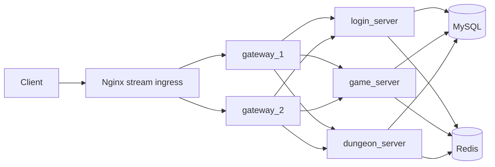
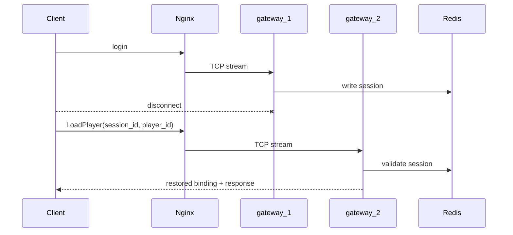

# Starter Kit One Pager

## What It Is
A lightweight mobile game backend starter kit focused on ingress scalability, session recovery, containerized deployment, and acceptance automation.

## Architecture

## Fault Recovery

## Expandability
- Add more gateway instances behind the same ingress
- Replace demo seed data with customer-specific configuration
- Extend game and dungeon services without changing the ingress contract

## Exclusions
- No multi-tenant SaaS control plane
- No live-ops GM console in this version
- No guarantee for public Internet scale-out by default
